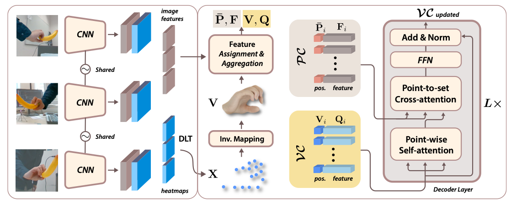

<!-- PROJECT LOGO -->

<p align="center">

  <h1 align="center">POEM: Reconstructing Hand in a Point Embedded Multi-view Stereo</h1>
  <p align="center">
    <a><strong>Lixin Yang</strong></a>
    ·
    <a><strong>Jian Xu</strong></a>
    ·
    <a><strong>Licheng Zhong</strong></a>
    ·
    <a><strong>Xinyu Zhan</strong></a>
    ·
    <a><strong>Zhicheng Wang</strong></a>
    .
    <a><strong>Kejian Wu</strong></a>
    .
    <a><strong>Cewu Lu</strong></a>
  </p>
  <h2 align="center">CVPR 2023</h2>
  <div align="center">
    
  </div>

  <p align="center">
    <br>
    <a href="https://arxiv.org/abs/2304.04038">
      
    </a>
  </p>
</p>

POEM is designed for "reconstructing hand geometry from multi-view". It combines the structure-aware MANO mesh with the unstructured point cloud in the intersected cameras' frustum space.
To infer accurate 3D hand mesh from multi-view images, POEM introduce the cross point set attention.
It achieves the state-of-the-art performance on three multi-view Hand-Object Datasets: HO3D, DexYCB, OakInk.
<br/><br/>

## :joystick: Instructions

- See [docs/installation.md](docs/installation.md) to setup the environment and install all the required packages.
- See [docs/datasets.md](docs/datasets.md) to download all the datasets and data assets.

&nbsp;

## :runner: Training and Evaluation

### Available models

- set `${MODEL}` as one in `[POEM, MVP, PEMeshTR, FTLMeshTR]`
- set `${DATASET}` as one in `[DexYCBMV, HO3Dv3MV, OakInkMV]`

Download the pretrained checkpoints at :link: [ckpt](https://huggingface.co/lixiny/POEM_CVPR2023/tree/main/ckpt_cvpr2023) and move the contents to `./checkpoint`.

### Command line arguments

- `-g, --gpu_id`, visible GPUs for training, e.g. `-g 0,1,2,3`. evaluation only supports single GPU.
- `-w, --workers`, num_workers in reading data, e.g. `-w 4`, recommend set `-w` equals to `-g` on HO3Dv3MV.
- `-p, --dist_master_port`, port for distributed training, e.g. `-p 60011`, set different `-p` for different training processes.
- `-b, --batch_size`, e.g. `-b 32`, default is specified in config file, but will be overwritten if `-b` is provided.
- `--cfg`, config file for this experiment, e.g. `--cfg config/release/${MODEL}_${DATASET}.yaml`.
- `--exp_id` specify the name of experiment, e.g. `--exp_id ${EXP_ID}`. When `--exp_id` is provided, the code requires that no uncommitted change is remained in the git repo. Otherwise, it defaults to 'default' for training and 'eval\_{cfg}' for evaluation. All results will be saved in `exp/${EXP_ID}*{timestamp}`.
- `--reload`, specify the path to the checkpoint (.pth.tar) to be loaded.

### Evaluation

Specify the `${PATH_TO_CKPT}` to `./checkpoint/${MODEL}_${DATASET}/checkpoint/{xxx}.pth.tar`. Then, run:

```shell
# use "--eval_extra" for extra evaluation.
#   "auc"            compute AUC of the predicted mesh.
#   "draw"           draw the predicted mesh of each batch.

$ python scripts/eval.py --cfg config/release/${MODEL}_${DATASET}.yaml -g 0 -b 8 --reload ${PATH_TO_CKPT}
```

The evaluation results will be saved at `exp/${EXP_ID}_{timestamp}/evaluations`.

### Training

```shell
$ python scripts/train_ddp.py --cfg config/release/${MODEL}_${DATASET}.yaml -g 0,1,2,3 -w 16
```

### Tensorboard

```shell
$ cd exp/${EXP_ID}_{timestamp}/runs/
$ tensorboard --logdir .
```

### Checkpoint

All the training checkpoints are saved at `exp/${EXP_ID}_{timestamp}/checkpoints/`

&nbsp;

## License

The code and model provided herein are available for usage as specified in [LICENSE](LICENSE) file. 
By downloading and using the code and model you agree to the terms in the [LICENSE](LICENSE).

## Citation

```bibtex
@inproceedings{yang2023poem,
    author    = {Yang, Lixin and Xu, Jian and Zhong, Licheng and Zhan, Xinyu and Wang, Zhicheng and Wu, Kejian and Lu, Cewu},
    title     = {POEM: Reconstructing Hand in a Point Embedded Multi-View Stereo},
    booktitle = {Proceedings of the IEEE/CVF Conference on Computer Vision and Pattern Recognition (CVPR)},
    month     = {June},
    year      = {2023},
    pages     = {21108-21117}
}
```

For more questions, please contact Lixin Yang: siriusyang@sjtu.edu.cn
